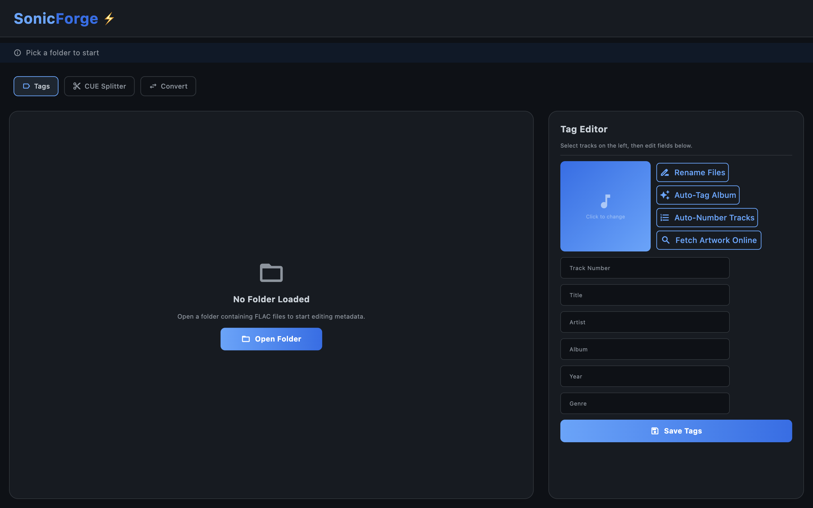

# SonicForge




A batch audio tag editor for FLAC files, built with Python and Flet.

## Features

- 📁 **Instant Parallel Loading**: Loads large music directories virtually instantaneously using concurrent thread pooling.
- ✏️ **Dual-Selection Modes**: Native range multi-selection (`Shift+Click`) alongside standard single-clicking for rapid editing.
- 🌐 **MusicBrainz Auto-Tagging**: Connects to the public MusicBrainz database to fetch complete, standardised album tag metadata, with a visual release card list and a dynamic, side-by-side track mapping preview with count mismatch warnings.
- 🖼️ **Unified Artwork Search**: Search and fetch high-resolution front covers online from iTunes and Deezer concurrently, or select from local files.
- 🔢 **Auto-Number Tracks**: Sorts and sequentially indexes chosen files automatically (`01`, `02`, `03`...).
- 🏷️ **Batch File Renaming**: Dynamically rename filenames based on custom tag patterns (e.g. `{track:02d} - {title}`) with robust character sanitisation and a live Before → After preview dialog.
- ✂️ **Lossless CUE Splitter**: Slices a single large album-length FLAC file into individual tracks natively and losslessly using a CUE sheet and FFmpeg, complete with automatic metadata tag injection and selective track check-boxes.
- 🔄 **Audio Transcoder**: Batch transcode audio files natively and asynchronously using FFmpeg. Supports encoding to high-quality **MP3** (with selectable bitrates), **OGG Vorbis** (with quality levels), and uncompressed **WAV** format, preserving all original tags, embedded artwork, and folder structures.
- 📊 **Space-Saving Metrics**: Provides real-time, side-by-side size difference reports for each file during transcoding and displays an aggregate space-saving summary (total MB and % reduction) upon completion.
- 💾 **Safe Local Write-back**: Validates and saves tags directly to the original FLAC files losslessly.

## Project Structure

```
SonicForge/
├── core/               # Business logic (metadata I/O, API client, image processing, state)
├── ui/                 # Flet UI components (main app, file table, tag editor, artwork dialog)
├── utils/              # Shared utilities (logger)
├── tests/              # Pytest unit tests
├── assets/             # Static UI assets (icons, etc.)
├── main.py             # Application entry point
├── requirements.txt
└── pytest.ini
```

## Setup

```bash
# Create and activate a virtual environment
python3 -m venv .venv
source .venv/bin/activate

# Install dependencies
pip install -r requirements.txt
```

## Running

```bash
# Run from the terminal:
python3 main.py 
``` 
Or double-click on `SonicForge.command`


## Packaging (Building `.app` for macOS)

To compile SonicForge into a standalone macOS `.app` that can be placed in your `/Applications` folder:

1. Install PyInstaller inside your virtual environment:
   ```bash
   pip install pyinstaller
   ```
2. Build the app bundle with the custom flat icon:
   ```bash
   flet pack main.py --icon assets/icon.icns --name "SonicForge"
   ```
This will generate `dist/SonicForge.app` which you can double-click or drag into your `/Applications` folder!

## Testing

```bash
python3 -m pytest tests/ -v
```

## Requirements

- Python 3.11+
- macOS (native dialog support via `osascript`; Linux/Windows fall back to tkinter)
- Dependencies listed in `requirements.txt`

